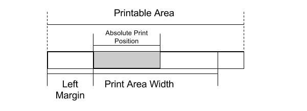
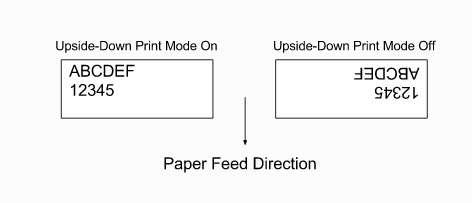
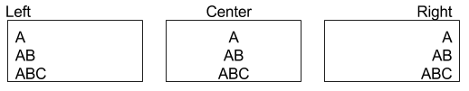
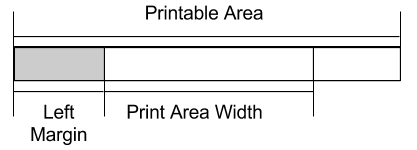
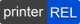

.. Common images should be declared here

.. |logo| image:: img/logo_small.png
   :align: middle

.. |pyramidqr| image:: img/pyramidacceptors.com.jpg
   :align: middle

   

   

.. |printablearea| image:: img/printablearea.png
   :align: middle

